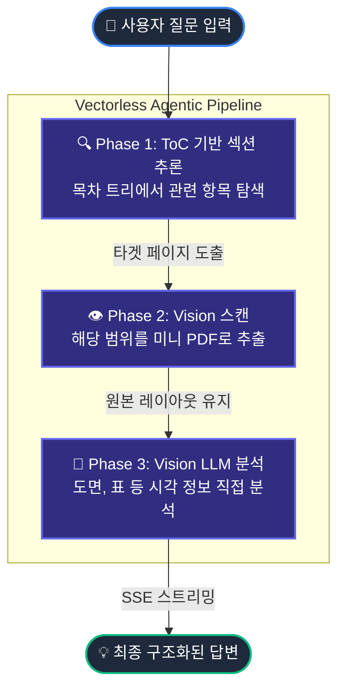

# 📑 Vision RAG

> **Vectorless Agentic Vision RAG** — 벡터 DB 없이 AI 에이전트가 매뉴얼을 탐색하는 차세대 검색 시스템

산업용 매뉴얼(PDF)을 AI가 **인간처럼 목차를 읽고 → 해당 페이지를 찾아가서 → 원본을 그대로 분석**하여 답변합니다.

---

## ✨ 주요 기능

| 기능 | 설명 |
|------|------|
| **2단계 추론 파이프라인** | Phase 1(ToC → 섹션) + Phase 2(Vision → 정밀 페이지) |
| **Vision 기반 ToC 자동 보강** | PDF 목차 페이지를 자동 탐색하여 3레벨 계층 목차 추출 (최대 291개 항목) |
| **멀티턴 대화** | 이전 Q&A 맥락을 유지하여 후속 질문 지원 ("그 근처 주소들은?") |
| **파일명 자동 추출** | PDF 메타데이터 + 첫 페이지에서 문서 제목 자동 인식 |
| **SSE 스트리밍** | 추론 과정 → 참조 이미지 → 답변을 실시간 스트리밍 |
| **프리미엄 UI** | 딥 네이비/바이올렛 다크모드, 글래스모피즘, 반응형 레이아웃 |

---

## 🏗 아키텍처



---

## 🛠 기술 스택

| 레이어 | 기술 |
|--------|------|
| **Frontend** | Next.js 16 + React 19 + Zustand + TailwindCSS 4 |
| **Backend** | Python 3.10+ / FastAPI |
| **PDF 처리** | PyMuPDF (fitz) — ToC 추출, 미니 PDF, 썸네일 |
| **AI** | Gemini 2.5 Pro (Vision, PDF 네이티브 입력) |
| **Orchestration** | LangChain (ChatGoogleGenerativeAI) |

---

## 🚀 설치 및 실행

### 1. 환경 변수 설정

```bash
# backend/.env
GEMINI_API_KEY=your_gemini_api_key
```

### 2. 백엔드 실행

```bash
cd backend
python3 -m venv venv
source venv/bin/activate
pip install -r requirements.txt
uvicorn app.main:app --host 0.0.0.0 --port 8000
```

### 3. 프론트엔드 실행

```bash
cd frontend
npm install
npm run dev
# → http://localhost:3000
```

---

## 📡 API 개요

| 메서드 | 엔드포인트 | 기능 |
|--------|-----------|------|
| `POST` | `/upload` | PDF 업로드 + ToC 자동 추출 |
| `GET` | `/documents` | 문서 목록 조회 |
| `GET` | `/documents/{id}` | 문서 상세 정보 |
| `PATCH` | `/documents/{id}` | 파일명 수정 |
| `DELETE` | `/documents/{id}` | 문서 삭제 |
| `GET` | `/documents/{id}/toc` | ToC 전체 조회 |
| `POST` | `/documents/{id}/reindex` | Vision 기반 ToC 재추출 |
| `POST` | `/chat/stream` | 질의·응답 (SSE 스트리밍) |

> 상세 API 스펙은 [doc/API_Contract.md](doc/API_Contract.md) 참조

---

## 📁 프로젝트 구조

```
Vision_RAG/
├── backend/
│   ├── app/
│   │   ├── main.py                   # FastAPI 앱
│   │   ├── config.py                 # 설정
│   │   ├── routers/
│   │   │   ├── chat.py               # 질의·응답 라우터
│   │   │   ├── documents.py          # 문서 관리 라우터
│   │   │   └── upload.py             # 업로드 라우터
│   │   ├── services/
│   │   │   ├── agentic_graph.py      # 2단계 추론 파이프라인
│   │   │   ├── agent_service.py      # Gemini Vision 호출
│   │   │   ├── metadata_service.py   # 문서 CRUD
│   │   │   └── pdf_service.py        # PDF 처리 + ToC 추출
│   │   └── schemas/
│   │       ├── request.py            # 요청 스키마
│   │       └── response.py           # 응답 스키마
│   └── requirements.txt
├── frontend/
│   ├── src/
│   │   ├── app/
│   │   │   ├── page.tsx              # 메인 페이지
│   │   │   └── globals.css           # 디자인 시스템
│   │   ├── components/
│   │   │   ├── chat/ChatMessage.tsx   # 채팅 메시지
│   │   │   └── layout/               # Sidebar, Header, ChatInput
│   │   ├── store/                    # Zustand 상태관리
│   │   └── lib/api.ts                # API 클라이언트
│   └── package.json
└── doc/
    ├── PRD.md                        # 제품 요구사항
    └── API_Contract.md               # API 규약
```

---

## 📊 테스트 결과

| 질문 | 결과 |
|------|------|
| 원점결정 버퍼메모리 주소 | ✅ `1500+100n` / `4300+100n` + Cd.3 |
| 알람코드 104 의미 | ✅ 하드웨어 스트로크 리미트+ |
| 알람코드 2505 분류 | ✅ 서보앰프 에러 (2000~2999) |
| 버퍼메모리 2800 기능 | ✅ 19번축 Pr.91 임의 데이터 모니터 |
| 멀티턴: "그 근처 주소들" | ✅ 2791~2803 주변 주소 목록 |

---

## 📝 라이선스

MIT License
