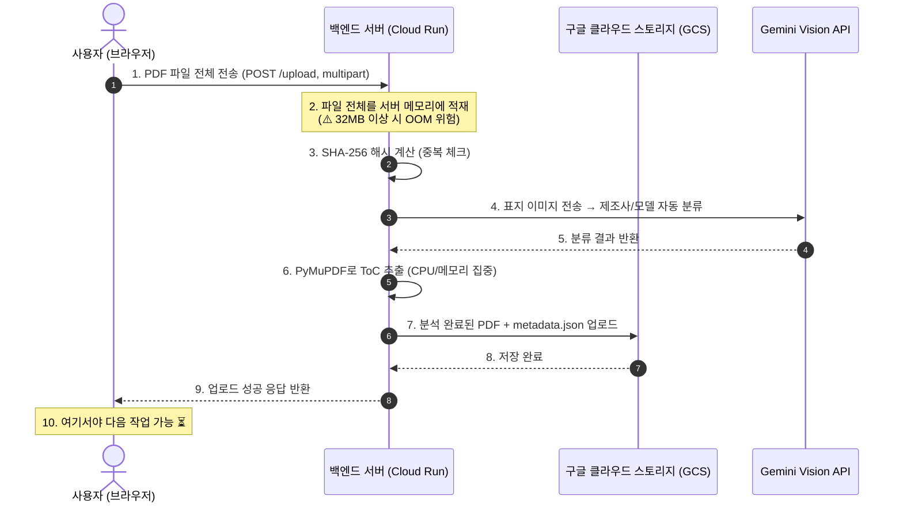
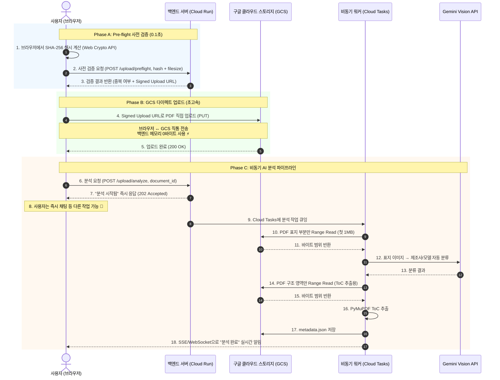

# 📑 대용량 업로드 고도화 — 비동기 GCS 다이렉트 업로드 아키텍처 기술 로드맵

대용량 매뉴얼(32MB+) 업로드 시 Cloud Run 메모리 OOM 이슈를 근본적으로 해결하고,
업로드 속도와 UX를 극대화하기 위한 **"Pre-flight + GCS Direct + Async Worker"** 아키텍처 설계 보고서입니다.

---

## 1. 현행 업로드 방식의 병목 분석

### 🔄 현행 업로드 흐름 (Sequence Diagram)



> [!WARNING]
> **병목 원인 3가지**
> 1. **메모리 폭발**: Cloud Run 기본 512MB 메모리에서 32MB PDF를 받으면, 파일 바이너리 + PyMuPDF 파싱 버퍼 + Gemini 요청 페이로드가 동시에 메모리를 점유하여 OOM(Out of Memory) 크래시 발생
> 2. **동기 대기**: 사용자는 SHA-256 해시 → AI 분류 → ToC 추출 → GCS 저장이 모두 끝날 때까지 로딩 화면만 응시해야 함
> 3. **동시성 제한**: 여러 사용자가 동시에 대용량 파일을 업로드하면 Cloud Run 인스턴스 전체가 메모리 압박으로 불안정해짐

---

## 2. 대안 아키텍처: Pre-flight + GCS Direct + Async Worker

### ⚡ 개선된 업로드 흐름 (Sequence Diagram)



---

## 3. Phase별 상세 설계

### Phase A: Pre-flight 사전 검증

브라우저에서 파일을 GCS에 올리기 **전에** 백엔드에 미리 물어보는 단계입니다.
중복 파일이나 잘못된 파일이 GCS에 올라가는 것을 원천 차단하여 **리소스 낭비를 방지**합니다.

#### 프론트엔드: 브라우저 SHA-256 해시 계산 (Web Crypto API)

```typescript
async function calculateFileHash(file: File): Promise<string> {
  const buffer = await file.arrayBuffer();
  const hashBuffer = await crypto.subtle.digest("SHA-256", buffer);
  const hashArray = Array.from(new Uint8Array(hashBuffer));
  return hashArray.map(b => b.toString(16).padStart(2, "0")).join("");
}
```

> [!TIP]
> `crypto.subtle.digest()`는 브라우저 내장 API로, 100MB 파일도 0.3초 내에 해시를 계산합니다.
> 서버에 파일을 전송하지 않고도 중복 체크가 가능해집니다.

#### 백엔드: Pre-flight 엔드포인트

```python
@router.post("/upload/preflight")
async def upload_preflight(request: PreflightRequest):
    """
    업로드 사전 검증: 중복 확인 + GCS Signed Upload URL 발급.
    """
    # 1. SHA-256 해시로 중복 문서 체크
    existing = metadata_service.find_document_by_hash(request.file_hash)
    if existing:
        raise HTTPException(
            status_code=409,
            detail=f"이미 등록된 문서입니다: {existing.get('filename')}"
        )

    # 2. 파일 크기 검증
    if request.file_size == 0:
        raise HTTPException(status_code=400, detail="빈 파일은 업로드할 수 없습니다.")

    # 3. 신규 document_id 생성 및 GCS Signed Upload URL 발급
    doc_id = str(uuid.uuid4())
    signed_url = _generate_signed_upload_url(doc_id)

    return {
        "status": "approved",
        "document_id": doc_id,
        "upload_url": signed_url,  # PUT 메서드용 Signed URL
    }


def _generate_signed_upload_url(document_id: str) -> str:
    """GCS에 파일을 직접 업로드할 수 있는 Signed URL(PUT) 생성."""
    import datetime
    client = storage.Client()
    bucket = client.bucket(settings.GCS_BUCKET_NAME)
    blob = bucket.blob(f"{document_id}/original.pdf")

    url = blob.generate_signed_url(
        version="v4",
        expiration=datetime.timedelta(minutes=15),
        method="PUT",
        content_type="application/pdf",
    )
    return url
```

#### Pre-flight 응답 스키마

```python
class PreflightRequest(BaseModel):
    file_hash: str        # 브라우저에서 계산한 SHA-256 해시
    file_size: int        # 파일 크기 (바이트)
    filename: str         # 원본 파일명

class PreflightResponse(BaseModel):
    status: str           # "approved" | "rejected"
    document_id: str      # 신규 발급된 UUID
    upload_url: str       # GCS Signed Upload URL (PUT)
```

---

### Phase B: GCS 다이렉트 업로드

Pre-flight에서 받은 Signed URL로 **브라우저가 GCS에 직접 파일을 전송**합니다.
백엔드 서버의 메모리/네트워크를 **0바이트도 사용하지 않습니다**.

#### 프론트엔드: GCS 다이렉트 업로드 + 진행률 추적

```typescript
async function uploadToGCS(
  file: File,
  signedUrl: string,
  onProgress?: (percent: number) => void
): Promise<void> {
  return new Promise((resolve, reject) => {
    const xhr = new XMLHttpRequest();
    xhr.open("PUT", signedUrl);
    xhr.setRequestHeader("Content-Type", "application/pdf");

    // 실시간 업로드 진행률 콜백
    xhr.upload.onprogress = (e) => {
      if (e.lengthComputable && onProgress) {
        onProgress(Math.round((e.loaded / e.total) * 100));
      }
    };

    xhr.onload = () => {
      if (xhr.status === 200) resolve();
      else reject(new Error(`GCS 업로드 실패: ${xhr.status}`));
    };
    xhr.onerror = () => reject(new Error("네트워크 오류"));
    xhr.send(file);
  });
}
```

> [!TIP]
> `XMLHttpRequest`를 사용하는 이유: `fetch` API는 업로드 진행률(`upload.onprogress`)을 지원하지 않습니다.
> `XMLHttpRequest`를 사용하면 대용량 파일 업로드 시 **실시간 퍼센트 프로그레스 바**를 UI에 표시할 수 있습니다.

---

### Phase C: 비동기 AI 분석 파이프라인

파일이 GCS에 올라간 직후, 백엔드에 **"분석 시작해줘"** 요청을 보내면
백엔드는 즉시 `202 Accepted`를 반환하고, 실제 무거운 AI 분석은 **백그라운드에서 비동기로** 처리합니다.

#### 백엔드: 분석 요청 엔드포인트

```python
@router.post("/upload/analyze")
async def trigger_analysis(request: AnalyzeRequest, background_tasks: BackgroundTasks):
    """
    GCS에 업로드된 PDF의 AI 분석을 비동기로 시작합니다.
    즉시 202 Accepted를 반환하고, 분석은 백그라운드에서 처리됩니다.
    """
    # 1. GCS에 파일이 존재하는지 확인
    bucket = _get_bucket()
    blob = bucket.blob(f"{request.document_id}/original.pdf")
    if not blob.exists():
        raise HTTPException(status_code=404, detail="GCS에 파일이 존재하지 않습니다.")

    # 2. 초기 메타데이터 생성 (status: "analyzing")
    initial_meta = {
        "document_id": request.document_id,
        "filename": request.filename,
        "file_hash": request.file_hash,
        "status": "analyzing",  # 분석 중 상태
        "uploaded_at": datetime.now(timezone.utc).isoformat(),
    }
    metadata_service.save_document_metadata(request.document_id, initial_meta)

    # 3. FastAPI의 BackgroundTasks로 비동기 분석 시작
    background_tasks.add_task(
        _run_analysis_pipeline,
        request.document_id,
        request.filename
    )

    return JSONResponse(
        status_code=202,
        content={
            "status": "analyzing",
            "document_id": request.document_id,
            "message": "AI 분석이 시작되었습니다. 완료 시 알림을 보내드립니다."
        }
    )
```

#### 백엔드: 비동기 분석 워커 (Range Read 기반)

```python
async def _run_analysis_pipeline(document_id: str, filename: str):
    """
    백그라운드에서 실행되는 AI 분석 파이프라인.
    GCS에서 PDF 전체를 다운로드하지 않고, 필요한 부분만 Range Read로 가져옵니다.
    """
    try:
        bucket = _get_bucket()
        blob = bucket.blob(f"{document_id}/original.pdf")

        # ── Step 1: 표지 분석 (앞부분 1MB만 Range Read) ──
        cover_bytes = blob.download_as_bytes(start=0, end=1_048_576)  # 첫 1MB
        manufacturer, model_series = await agent_service.classify_cover(cover_bytes)

        # ── Step 2: ToC 추출 (전체 PDF 구조 필요 → 임시 파일로 스트리밍) ──
        # PyMuPDF는 전체 PDF 구조가 필요하므로, /tmp에 스트리밍 다운로드
        import tempfile
        with tempfile.NamedTemporaryFile(suffix=".pdf", delete=True) as tmp:
            blob.download_to_filename(tmp.name)
            doc = fitz.open(tmp.name)
            total_pages = doc.page_count
            toc = find_and_extract_toc(doc, total_pages)
            doc.close()

        # ── Step 3: 메타데이터 확정 및 저장 ──
        final_meta = {
            "status": "indexed",
            "manufacturer": manufacturer,
            "model_series": model_series,
            "total_pages": total_pages,
            "toc": toc,
        }
        metadata_service.update_document_metadata(document_id, final_meta)
        logger.info(f"✅ 비동기 분석 완료: {document_id} ({filename})")

    except Exception as e:
        logger.error(f"❌ 비동기 분석 실패: {document_id} - {e}")
        metadata_service.update_document_metadata(document_id, {
            "status": "error",
            "error_message": str(e),
        })
```

> [!NOTE]
> **PyMuPDF(fitz)의 한계**: ToC 추출은 PDF의 cross-reference table을 파싱해야 하므로
> Range Read만으로는 불가능합니다. 따라서 ToC 추출 단계에서만 `/tmp`에 임시 다운로드를 사용합니다.
> 단, 이때 **사용자는 이미 업로드를 완료하고 다른 작업을 하고 있으므로** 체감 지연은 없습니다.

---

### 프론트엔드: 문서 상태 배지 UI

비동기 분석 중에는 사이드바 문서 목록에 실시간 상태 배지를 표시합니다.

```typescript
// 문서 상태에 따른 배지 렌더링
function getStatusBadge(status: string) {
  switch (status) {
    case "analyzing":
      return { icon: "🤖", text: "AI 분석 중...", className: "animate-pulse text-amber-500" };
    case "indexed":
      return { icon: "✅", text: "분석 완료", className: "text-emerald-500" };
    case "error":
      return { icon: "❌", text: "분석 실패", className: "text-red-500" };
    default:
      return null;
  }
}
```

---

## 4. 프론트엔드 통합 업로드 플로우

세 단계를 하나로 엮은 프론트엔드 전체 업로드 함수입니다.

```typescript
async function uploadDocumentAsync(file: File, onProgress?: (p: number) => void) {
  // ── Phase A: Pre-flight ──
  const fileHash = await calculateFileHash(file);
  const preflight = await fetch(`${API}/upload/preflight`, {
    method: "POST",
    headers: { "Content-Type": "application/json" },
    body: JSON.stringify({
      file_hash: fileHash,
      file_size: file.size,
      filename: file.name,
    }),
  });

  if (!preflight.ok) {
    const err = await preflight.json();
    throw new Error(err.detail || "사전 검증 실패");
  }

  const { document_id, upload_url } = await preflight.json();

  // ── Phase B: GCS 다이렉트 업로드 ──
  await uploadToGCS(file, upload_url, onProgress);

  // ── Phase C: 비동기 분석 요청 ──
  const analyze = await fetch(`${API}/upload/analyze`, {
    method: "POST",
    headers: { "Content-Type": "application/json" },
    body: JSON.stringify({
      document_id,
      filename: file.name,
      file_hash: fileHash,
    }),
  });

  if (!analyze.ok) throw new Error("분석 요청 실패");

  return { document_id, status: "analyzing" };
}
```

---

## 5. 기대 효과 비교

| 항목 | 현행 (동기식 백엔드 중개) | 개선안 (비동기 GCS 다이렉트) |
|------|--------------------------|------------------------------|
| **업로드 용량 제한** | ~32MB (Cloud Run 메모리 한계) | **무제한** (GCS 최대 5TB) |
| **백엔드 메모리 사용** | 파일 크기 × 2~3배 | **~0MB** (Phase B에서 백엔드 미경유) |
| **사용자 대기 시간** | 해시 + AI + ToC + GCS = 전부 대기 | **GCS 업로드 완료 즉시 해방** |
| **동시 업로드 안정성** | 3~4명 동시 업로드 시 OOM 위험 | **수백 명 동시 업로드 가능** |
| **업로드 진행률** | 대략적 추정 | **정확한 바이트 단위 실시간 퍼센트** |
| **중복 파일 처리** | 서버에 전송 후 판별 | **전송 전에 브라우저에서 판별** |
| **구현 복잡도** | 🟢 낮음 | 🟡 중간 |

---

## 6. 구현 시 고려사항

### 6-1. GCS CORS 업데이트 (PUT 메서드 추가)

현재 CORS 설정은 `GET`만 허용하고 있으므로, `PUT`을 추가해야 합니다.

```json
[
  {
    "origin": ["*"],
    "method": ["GET", "PUT"],
    "responseHeader": ["Content-Type", "Content-Disposition"],
    "maxAgeSeconds": 3600
  }
]
```

### 6-2. IAM 권한

현재 부여된 `roles/iam.serviceAccountTokenCreator`로 Signed Upload URL(PUT)도 생성 가능하므로
**추가 권한 작업 불필요**.

### 6-3. Cloud Run 메모리 설정

비동기 워커가 ToC 추출 시 `/tmp`에 임시 파일을 쓰므로,
Cloud Run의 `--memory` 설정을 현재 수준으로 유지하되,
**`--cpu-boost`** 옵션을 활성화하면 Cold Start 시 분석 속도가 개선됩니다.

### 6-4. 분석 실패 시 복구 전략

```
[분석 실패] → metadata.status = "error"
           → 사이드바에 ❌ 배지 + "재분석" 버튼 표시
           → 사용자가 "재분석" 클릭 시 POST /upload/analyze 재호출
           → GCS에 원본 PDF가 이미 있으므로 재업로드 불필요
```

### 6-5. 단계적 마이그레이션 전략 (권장)

> [!IMPORTANT]
> 기존 동기식 업로드 API(`POST /upload`)를 즉시 삭제하지 말고,
> 파일 크기에 따라 **자동 분기**하는 하이브리드 방식을 권장합니다.

```
if (file.size < 20MB) → 기존 동기식 업로드 (간단, 안정적)
if (file.size >= 20MB) → 비동기 GCS 다이렉트 업로드 (고성능)
```

이렇게 하면 **소형 파일은 기존 코드의 안정성을 그대로 누리면서**,
**대형 파일만 새 파이프라인을 타도록** 점진적으로 전환할 수 있습니다.

---

## 7. 종합 요약 및 착수 조건

*   **현재 상태**: 동기식 백엔드 중개 업로드 방식으로 안정적 운영 중. 32MB 이상 대용량 파일에서 메모리 한계 확인됨.
*   **착수 시점**: 대용량 매뉴얼(50MB+) 업로드 수요 증가 시, 또는 동시 사용자 10명 이상 운영 시점.
*   **예상 작업 기간**: 백엔드 2일 + 프론트엔드 1일 + 테스트 1일 = 약 4일.
*   **선행 조건**: GCS CORS에 `PUT` 메서드 추가 (명령어 1줄), 그 외 IAM 권한은 이미 확보 완료.
