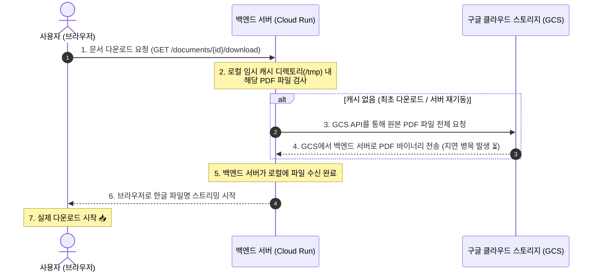
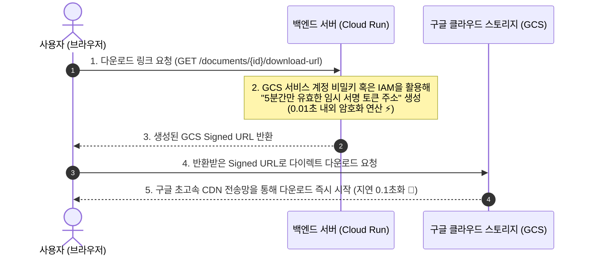

# 📑 문서 다운로드 핫픽스 리포트 및 고속 서명 링크(Signed URL) 기술 로드맵

42개 대용량 매뉴얼 실사용 일괄 업로드 테스트 성공 과정에서 도출된 **개별 문서 다운로드 이슈의 핫픽스 조치 내역**과, 향후 쾌적한 다운로드 속도 제공을 위해 논의된 **임시공유 서명링크(GCS Signed URL) 기술 로드맵** 아키텍처 분석 보고서입니다.

---

## 1. 한글 파일명 다운로드 핫픽스 리포트
사용자 실사용 테스트 중 다운로드 아이콘(`📥`) 클릭 시 발생했던 **다운로드 실패 현상**에 대한 원인 분석 및 해결 조치 사항입니다.

### 🔍 원인 분석 (Starlette UnicodeEncodeError)
*   **원인**: 백엔드가 다운로드 파일을 응답할 때, HTTP 헤더의 `Content-Disposition: filename="{download_name}"`에 한글 유니코드 문자열을 가공 없이 주입했습니다.
*   **문제점**: ASGI 웹 프레임워크인 Starlette(FastAPI 기반)은 표준 HTTP 규격 준수를 위해 헤더 값을 내부적으로 `latin-1` 인코딩으로 인코딩하려 시도합니다. 이때 `latin-1` 범위를 넘어선 한글(Unicode) 문자를 만나면서 `UnicodeEncodeError (500 Internal Server Error)`를 던지고 파일 전송을 완전히 차단했던 버그였습니다.

### 🛠️ 해결 조치 (RFC 5987 표준 규격 적용)
*   **조치**: `filename="document.pdf"`와 같이 안전한 영문/ASCII fallback 값을 지정하여 인코딩 충돌을 예방하는 동시에, 실제 한글 파일명은 브라우저 표준 명세인 **`filename*=UTF-8''{encoded_filename}`** 규격에 URL 인코딩을 적용해 주입했습니다.
*   **결과**: 백엔드와 프론트엔드가 표준 스펙으로 완전히 호환되어, 모바일 및 PC 브라우저 환경에서 깨짐 없이 완벽한 한글 파일명(`제조사_모델시리즈_유형.pdf`)으로 정상 다운로드됩니다.

---

## 2. 현행 다운로드 방식의 병목 분석 (백엔드 중개 방식)
현재 문서 다운로드 시 초기 지연 시간(Time-to-First-Byte)이 수 초간 소요되는 병목 현상의 흐름입니다.

### 🔄 현행 다운로드 흐름 (Sequence Diagram)



> [!WARNING]
> **병목 원인**: 다운로드를 누르는 순간, 백엔드 서버가 원격 GCS 저장소에서 파일 **전체**를 다운로드받는 과정(3~4단계)이 선행되어야만 브라우저 스트리밍을 시작할 수 있습니다. 이 구간에서 서버 디스크/네트워크 병목 및 딜레이가 필연적으로 수반됩니다.

---

## 3. 대안 아키텍처: GCS 임시공유 서명링크 (Signed URL) 도입 로드맵
향후 대용량 상용 서비스 전환이나 쾌적한 UX 보장을 위해 도입할 **임시공유 서명링크(Signed URL)** 아키텍처 설계도입니다.

### ⚡ 개선된 다운로드 흐름 (Sequence Diagram)



### 💎 Signed URL 도입 시 기대 효과
1.  **초기 지연 시간 제로화 (0.1초 반응)**: 백엔드가 대용량 파일을 직접 읽거나 다운로드받아 중개할 필요가 없으므로, 다운로드 클릭 시 즉각 다운로드 창이 열립니다.
2.  **백엔드 서버 비용 절감 및 무한 확장성**: 백엔드 서버의 메모리/네트워크 대역폭을 소모하지 않기 때문에, 동시 다운로드 사용자가 수천 명이 발생하더라도 백엔드 인프라가 전혀 영향을 받지 않습니다.
3.  **최고 수준의 보안 (DRM)**: 5분 후면 링크가 자동 파괴되어 영구 만료되므로, 불법 다운로드 링크 유출 및 크롤링 무단 수집이 원천적으로 차단됩니다.

### 📝 백엔드 구현 가이드 (Python Code Blueprint)
GCS Signed URL 생성 기능을 구현할 때 적용할 파이썬 비즈니스 로직 설계 코드입니다.

```python
import datetime
from google.cloud import storage
from app.config import settings

def generate_gcs_download_url(document_id: str, filename: str) -> str:
    """
    GCS에 저장된 원본 PDF 파일의 5분 만료 임시 다운로드 서명 링크(Signed URL)를 생성합니다.
    """
    client = storage.Client()
    bucket = client.bucket(settings.GCS_BUCKET_NAME)
    blob = bucket.blob(f"{document_id}/original.pdf")
    
    # RFC 5987 표준 한글 파일명 헤더 세팅 주입
    from urllib.parse import quote
    encoded_filename = quote(filename)
    content_disposition = f"attachment; filename=\"document.pdf\"; filename*=UTF-8''{encoded_filename}"
    
    # 5분 동안만 유효한 보안 임시 주소 서명 생성
    url = blob.generate_signed_url(
        version="v4",
        expiration=datetime.timedelta(minutes=5),
        method="GET",
        response_content_disposition=content_disposition,
        response_content_type="application/pdf"
    )
    return url
```

---

## 4. 종합 요약 및 검증 스케줄
*   **현재 상태**: `latin-1` 헤더 변환 버그에 대응하여 RFC 5987 규격을 적용한 백엔드 핫픽스 배포(`vision-rag-backend-00009-g89`)가 완료되어 한글 파일명 다운로드 안정성이 검증되었습니다.
*   **스마트 UX 가이드**: 다운로드 대기 속도에 대한 사용자 오해를 방지하고자 다운로드 전 한글 파일명과 경고 팝업을 보여주는 Confirm 대화상자를 연동 완료했습니다.
*   **고도화 스케줄**: 충분한 현행 기능 테스트 완료 후, 서비스 상용화 또는 대용량 유저 대응 시점에 본 분석 보고서의 **GCS Signed URL 로드맵**을 바탕으로 백-프론트엔드 연동을 전환할 예정입니다.
