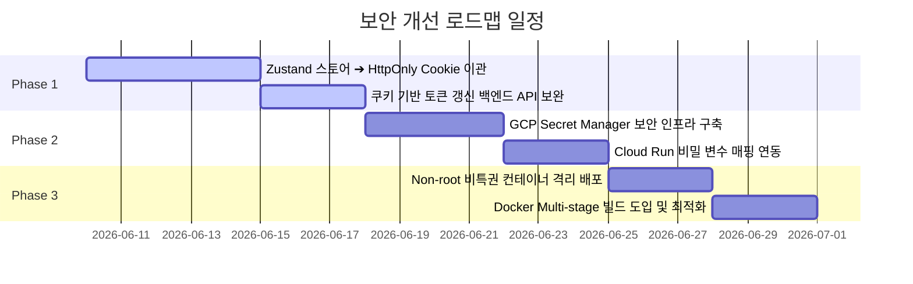

# 🛡️ Vision RAG 시스템 중장기 보안 개선 로드맵

본 문서는 Vision RAG 시스템의 장기적인 운영 안전성과 사용자의 개인정보 보안 수준을 엔터프라이즈 급으로 격상하기 위해 필요한 **중·장기 보안 설계 및 기술적 조치 로드맵**입니다.

---

## 📅 로드맵 개요 (Roadmap Overview)

---

## 🔒 1단계: Refresh Token 쿠키 기반 저장 아키텍처 전환 (XSS 원천 방어)

현재 Next.js 프론트엔드는 Zustand의 `localStorage` 연동을 통해 토큰을 영구 저장하므로 XSS(Cross-Site Scripting) 취약점에 노출되어 있습니다. 이를 쿠키(Cookie) 구조로 전환합니다.

### 1) 기술적 변경 내역 (Technical Details)
- **프론트엔드 (Zustand & API Client)**:
  - Access Token은 웹 애플리케이션 메모리(Zustand 스토어 변수)에만 들고 있으며, 새로고침이나 세션 만료 시 백엔드에 토큰 갱신 요청을 시도합니다.
  - Refresh Token은 `localStorage` 저장 목록에서 **제외**합니다.
- **백엔드 (FastAPI)**:
  - `/api/auth/google` 및 `/api/auth/refresh` 엔드포인트 수정:
    - 로그인 및 갱신 성공 시, HTTP 응답의 `Set-Cookie` 헤더를 통해 Refresh Token을 브라우저에 내려줍니다.
    - 쿠키 옵션 필수 설정:
      - `httponly=True`: 브라우저 자바스크립트가 토큰을 탈취하는 것을 차단.
      - `secure=True`: HTTPS 연결에서만 쿠키 전송 보장.
      - `samesite="Lax"` (또는 `"Strict"`): CSRF(교차 사이트 요청 위조) 공격 방어.
    - `/api/auth/refresh` API 호출 시 Request Body가 아닌 Cookie 헤더에서 Refresh Token을 추출해 검증하도록 변경합니다.

---

## 🔑 2단계: GCP Secret Manager 도입 (평문 키 노출 방지)

현재 배포 파이프라인(`cloudbuild.yaml`)은 Cloud Run에 컨테이너를 올릴 때 API Key와 Client ID 등을 `--set-env-vars` 인자로 직접 평문 주입하고 있어 GCP 콘솔 사용자에게 민감키가 완전 노출되는 리스크가 있습니다.

### 1) 기술적 변경 내역 (Technical Details)
- **Secret Manager 리소스 등록**:
  - Google Cloud Secret Manager에 아래 비밀값들을 버전별로 생성 및 관리합니다.
    - `GEMINI_API_KEY`
    - `GOOGLE_CLIENT_ID`
    - `JWT_SECRET`
- **IAM 권한 할당**:
  - Cloud Run 서비스 구동 계정(Service Account)에 `Secret Manager Secret Accessor` (보안 비밀 접근자) 권한을 부여합니다.
- **배포 설정 수정 (`cloudbuild.yaml` 및 Cloud Run)**:
  - `gcloud run deploy` 명령어에서 환경변수 평문 선언을 제거하고, Secret Manager의 보안 비밀을 컨테이너 내 환경변수로 매핑하도록 인프라 구성을 변경합니다.
  - **Uvicorn/FastAPI** 애플리케이션은 기존과 동일하게 `BaseSettings`를 통해 OS 환경변수로부터 키들을 정상 주입받아 작동하므로 백엔드 비즈니스 로직 수정이 불필요합니다.

---

## 🐳 3단계: Docker 컨테이너 운영 보안 강화 (최소 권한 격리)

현재 배포용 `Dockerfile`은 시스템 프로세스를 기본 `root` 권한으로 동작시키고 있으며, `/app/uploads` 폴더에 `777` (실행 포함 전체 개방) 권한을 주고 있어 컨테이너 탈취 시 2차 내부 망 침투 및 원격 코드 실행(RCE) 우려가 있습니다.

### 1) 기술적 변경 내역 (Technical Details)
- **비특권 유저(Non-root User) 생성**:
  - `Dockerfile` 내부 빌드 시점에 별도의 시스템 그룹과 사용자(`appuser`)를 만들어 권한을 강제 전환합니다.
- **권한 최소화 (Read/Write Only)**:
  - 파일 업로드 저장소(`/app/uploads`)의 실행 권한(`x`)을 박탈하고 읽기/쓰기만 가능한 `750` 또는 `755` 권한으로 축소하여 소유권을 `appuser`에게만 매핑합니다.
- **Multi-stage Build 적용**:
  - 빌드 전용 단계(Compiler/Tools 설치)와 최종 실행 환경을 분리하여, 운영용 이미지 내에는 `build-essential` 등 컴파일러 툴체인과 개발용 테스트 의존성 패키지(`pytest` 등)가 절대 탑재되지 않도록 최종 이미지 크기를 극소화하고 취약 패키지 면적을 축소합니다.

---

## 🛠️ 단계별 실행 방안 가이드라인

| 단계 | 추진 과제 | 소요 기간 | 예상 리스크 및 예방책 |
| :---: | :--- | :---: | :--- |
| **Phase 1** | Refresh Token `HttpOnly` 쿠키 이관 | 3 ~ 4일 | **Cross-Origin 쿠키 차단 문제** - 로컬 개발(`localhost:3000` -> `localhost:8000`) 환경과 배포 환경의 도메인이 다를 시 쿠키가 전송되지 않을 수 있음. - `sameSite="None"`, `secure=True` 조합을 적극 테스트하거나 개발/운영 환경 쿠키 도메인 분리 적용 필요. |
| **Phase 2** | GCP Secret Manager 인프라 매핑 | 2일 | **IAM 권한 오류** - Cloud Run 기동 서비스 어카운트에 보안 비밀 접근자 권한이 올바르게 누락 없이 매핑되었는지 테넌트 검증. |
| **Phase 3** | Docker 컨테이너 보안 하드닝 | 2일 | **로컬 파일 권한 에러** - 비특권 유저 전환 시 `/app/uploads`나 로컬 캐시 폴더 생성 시 `Permission Denied`가 발생하지 않도록 디렉터리 소유권(`chown`) 설정을 정교하게 확인. |
